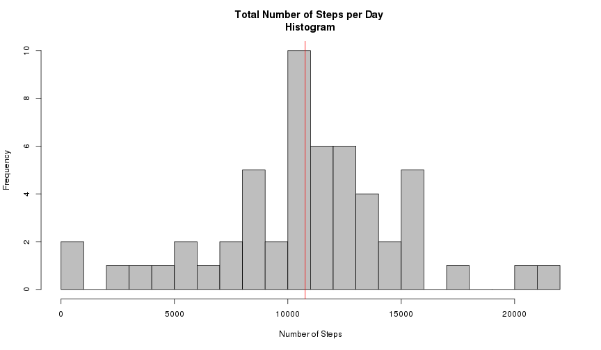
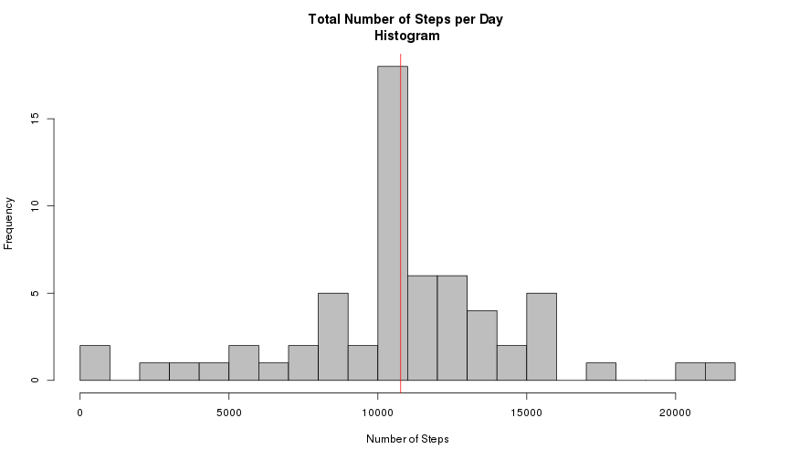

## Coursera.org 
# Reproducible Research Course   
## Peer Assessment 1


The data for this assignment is available [here] (https://d396qusza40orc.cloudfront.net/repdata%2Fdata%2Factivity.zip)

The variables included in this dataset are:

- steps: Number of steps taking in a 5-minute interval (missing values are coded as NA)
- date: The date on which the measurement was taken in YYYY-MM-DD format
- interval: Identifier for the 5-minute interval in which measurement was taken

The dataset is stored in a comma-separated-value (CSV) file and includes a total of 17,568 observations.


## 1. Loading and preprocessing the data

After downloading and unzipping dataset file, we can load the data

```r
actData <- read.csv("activity.csv")
```
and prepare 1) a data set **histData** including the total numbers of steps taken each day

```r
histData <- aggregate(steps ~ date, data=actData, FUN=sum)
head(histData)
```

```
##         date steps
## 1 2012-10-02   126
## 2 2012-10-03 11352
## 3 2012-10-04 12116
## 4 2012-10-05 13294
## 5 2012-10-06 15420
## 6 2012-10-07 11015
```
Also we need to create 2) a data set **intervalData** including the means of steps taken per interval

```r
intervalData <- aggregate(steps ~ interval, data=actData, FUN=mean)
head(intervalData)
```

```
##   interval     steps
## 1        0 1.7169811
## 2        5 0.3396226
## 3       10 0.1320755
## 4       15 0.1509434
## 5       20 0.0754717
## 6       25 2.0943396
```
These data sets will be useful for us to answer the questions of this assignment.

## 2. What is mean total number of steps taken per day?

Let's plot a histogram of the total number of steps taken each day:

```r
hist(histData$steps, breaks=30, col="grey", border="black", 
     main="Total Number of Steps per Day \nHistogram", xlab="Number of Steps")
abline(v=mean(histData$steps), col="red")
```

 

We can calculate the mean and median total number of steps taken per day:

```r
meanVal <- mean(histData$steps)
medianVal <- median(histData$steps)
```

So **the Mean** = 1.07662 &times; 10<sup>4</sup> , **the Median** = 1.0765 &times; 10<sup>4</sup>  


## 3. What is the average daily activity pattern?

The time series plot of the 5-minute intervals vs the average number of steps is very demonstrative:

```r
plot(intervalData$steps  ~ intervalData$interval, type="l", main="Average Daily Activity Pattern", 
     xlab="Time Intervals", ylab="Steps")

stepMaxIntrvl <- intervalData$interval[which.max(intervalData$steps)]
abline(v=stepMaxIntrvl, col="red")
text(900, y = 0, labels="835", col="red")
```

 

The **835'th** 5-minute Interval contains the maximum number of steps. 

## 4. Imputing missing values

Primarily let's test the original data set on NA rows:

```r
naNum <- sum(is.na(actData))
```
Totale number NA rows = **2304**

Now let's look at summary of original data set:

```r
summary(actData)
```

```
##      steps                date          interval     
##  Min.   :  0.00   2012-10-01:  288   Min.   :   0.0  
##  1st Qu.:  0.00   2012-10-02:  288   1st Qu.: 588.8  
##  Median :  0.00   2012-10-03:  288   Median :1177.5  
##  Mean   : 37.38   2012-10-04:  288   Mean   :1177.5  
##  3rd Qu.: 12.00   2012-10-05:  288   3rd Qu.:1766.2  
##  Max.   :806.00   2012-10-06:  288   Max.   :2355.0  
##  NA's   :2304     (Other)   :15840
```

We can see it's the steps column only contains NAs.  
So let's fill the NA cells with mean values for corresponding 5-minute intervals.  

Primarily we must create set of NA raws ID (*naCells*):  


```r
naCells <- which(is.na(actData$steps))
fullActData <- actData
```


Now we can use loop to substitute NA values with mean value from *intervalData* of the same intervals:

```r
for(i in naCells){
  fullActData$steps[i] <- intervalData$steps[intervalData$interval == fullActData$interval[i]]
}
```
OR we can just repeat values of intervalData 61 times and so again substitute NA values with corresponding mean values:

```r
avrVals <- rep(intervalData$steps, times=61)
fullActData <- cbind(actData, avrVals)
fullActData$steps[naCells] <- fullActData$avrVals[naCells]
```
The same results. At any cases we have new data set *fullActData* containing means interval values instead of NA.
We plot the histogram based on this data set: 

```r
histData <- aggregate(steps ~ date, data=fullActData, FUN=sum)
hist(histData$steps, breaks=30, col="grey", border="black", 
     main="Total Number of Steps per Day \nHistogram", xlab="Number of Steps")
abline(v=mean(histData$steps), col="red")
```

 

```r
meanValNew <- mean(histData$steps)
medianValNew <- median(histData$steps)
```

And we can see that imputing missing values make the median values of steps number more frequent.  
**The Mean** = 1.07662 &times; 10<sup>4</sup> , **The Median** = 1.07662 &times; 10<sup>4</sup>

## 5. Are there differences in activity patterns between weekdays and weekends?

I need to set up standard locale for time formats
because the week days names in my locale have another names

```r
sysLoc <- Sys.setlocale(category = "LC_TIME", locale = "C")
```

Define weekday and weekend dates:


```r
wDays <- weekdays(as.Date(fullActData$date))
wDays <- gsub("Saturday|Sunday", replacement="weekend", wDays)
wDays <- gsub("Monday|Tuesday|Wednesday|Thursday|Friday", replacement="weekday", wDays)
```

Now return to native locale for time formats


```r
sysLoc <- Sys.setlocale(category = "LC_TIME", locale = "")
```

Set the data for weekends and weekdays:


```r
fullActData <- cbind(fullActData, wDays)

weekendData <- fullActData[fullActData$wDays == "weekend",]
weekdayData <- fullActData[fullActData$wDays == "weekday",]
weekendData <- aggregate(steps ~ interval, data=weekendData, FUN=mean)
weekdayData <- aggregate(steps ~ interval, data=weekdayData, FUN=mean)
```

Plot the data:

```r
op <- par(mfrow=c(2,1))
plot(steps  ~ interval, data = weekendData, type="l", main="Average Daily Activity Pattern\n Weekends", 
     xlab="Time intervals", ylab="Steps")
plot(steps ~ interval, data = weekdayData, type="l", main="Weekdays", 
     xlab="Time Intervals", ylab="Steps")
```

 

```r
par(op)
```

So we can see  
1. Weekdays activity max value is more then Weekend one (**230.3781971** vs **166.6391509**)  
2. Nevertheless the mean value of Weekend activity is more then mean activity of Weekdays (**42.3664013** vs **35.6105812**)  
3. The most active intervals are approximately the same at weekdays or weekends. 
